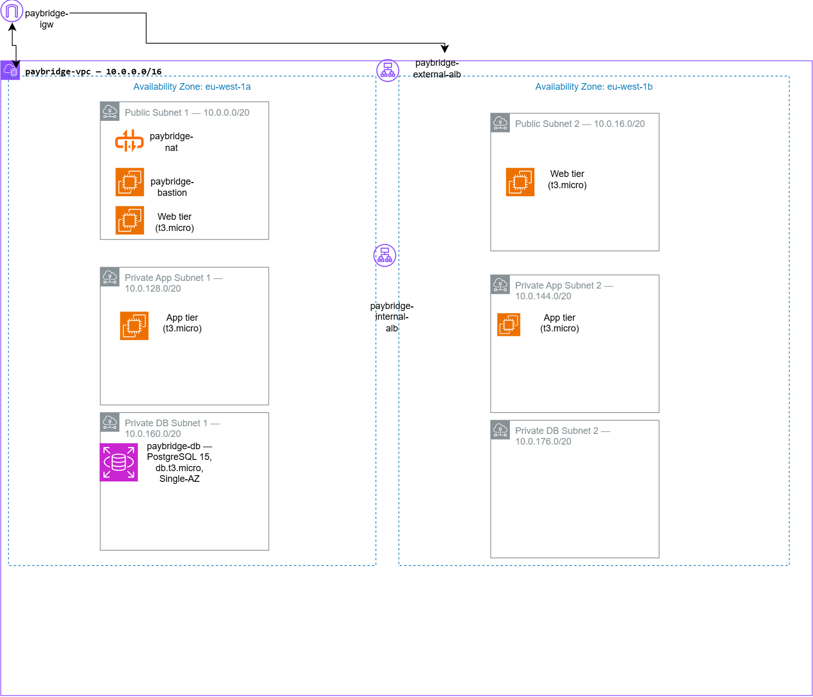

# PayBridge — Production-Grade 3-Tier AWS Infrastructure

A Multi-AZ, 3-tier microservice architecture built on AWS for a fintech-style application, provisioned entirely through the AWS Management Console as part of an AWS Cloud Engineering capstone project.

---

## Overview

PayBridge simulates the infrastructure a fintech startup would need to launch: a web front end, an internal API layer, and a PostgreSQL database, spread across two Availability Zones for resilience, with each tier isolated from the others at the network level.

| | |
|---|---|
| **Region** | eu-west-1 (Ireland) |
| **VPC CIDR** | 10.0.0.0/16 |
| **Availability Zones** | eu-west-1a, eu-west-1b |
| **Provisioning method** | AWS Management Console (see [Provisioning Method](#provisioning-method) below) |
| **Estimated cost** | ~$127/month (full breakdown below) |

---

## Architecture

**Three tiers, each with its own subnet pair, security group, and scaling policy:**

| Tier | Compute | Subnet Type | Responsibility |
|---|---|---|---|
| Web | EC2 Auto Scaling (`paybridge-web-asg`) | Public | Handles HTTP/S traffic from the external ALB |
| Application | EC2 Auto Scaling (`paybridge-app-asg`) | Private | Internal API layer, no direct internet exposure |
| Database | RDS PostgreSQL (`paybridge-db`) | Private | Data persistence, isolated from both compute tiers |

**Networking:**

| Resource | CIDR |
|---|---|
| VPC | 10.0.0.0/16 |
| Public Subnet 1 (eu-west-1a) | 10.0.0.0/20 |
| Public Subnet 2 (eu-west-1b) | 10.0.16.0/20 |
| Private App Subnet 1 (eu-west-1a) | 10.0.128.0/20 |
| Private App Subnet 2 (eu-west-1b) | 10.0.144.0/20 |
| Private DB Subnet 1 (eu-west-1a) | 10.0.160.0/20 |
| Private DB Subnet 2 (eu-west-1b) | 10.0.176.0/20 |

- **Internet Gateway** (`paybridge-igw`) — attached to the VPC, routes public-subnet traffic
- **NAT Gateway** (`paybridge-nat`) — sits in Public Subnet 1, gives private-subnet resources outbound-only internet access (package installs, AWS API calls) without any inbound path
- **Two route tables** — `public-rtb` (→ IGW) and `private-rtb` (→ NAT Gateway)

**Traffic flow:**
